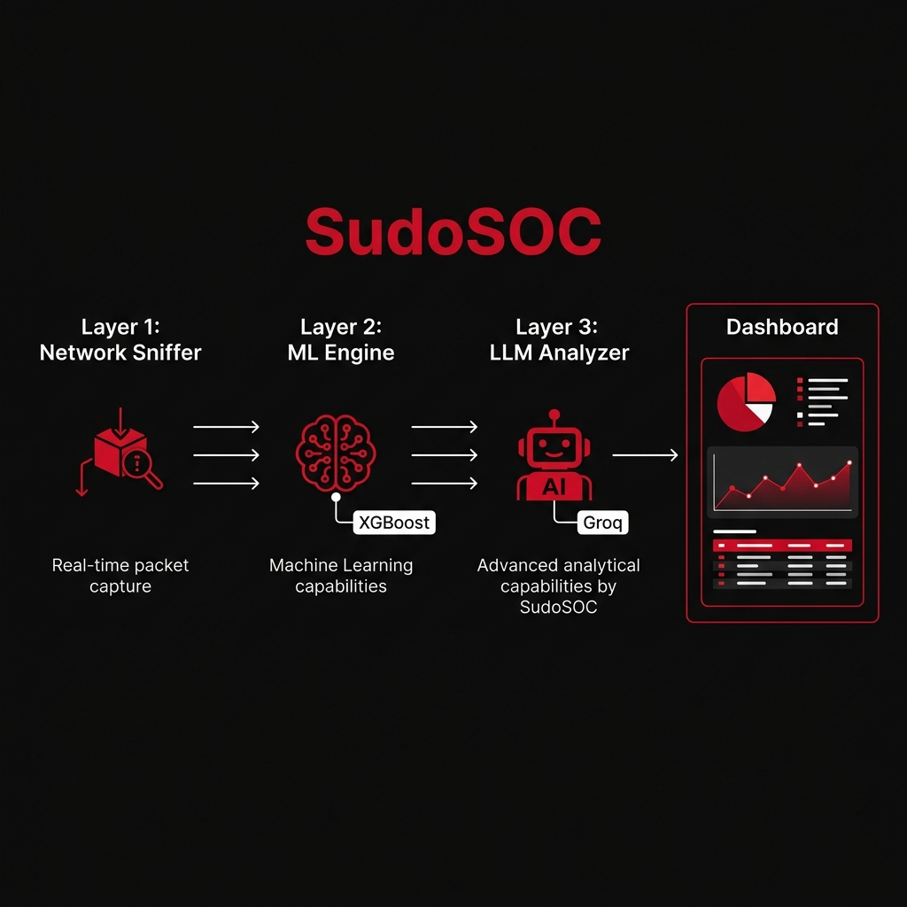
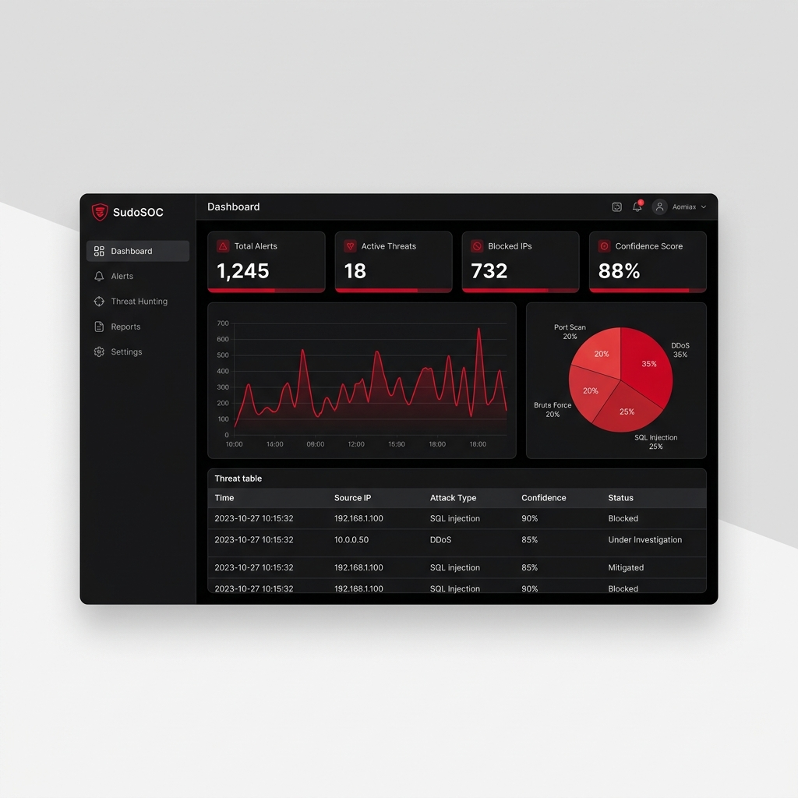

#  SudoSOC: Adaptive IDS/IPS & Decryption Sniffer Platform

SudoSOC is an enterprise-grade, state-of-the-art **Intrusion Detection & Prevention System (IDS/IPS)** that combines real-time packet capturing, deep SSL/TLS decryption sniffing, machine learning-driven threat classification (XGBoost/RandomForest), and Generative AI-powered log explainability.

Designed with a premium high-contrast **red and black cyber-defense interface**, SudoSOC provides real-time security observability, adaptive model training, and active feedback loops for automated threat mitigation.

---

## 📖 Detailed Project Overview (About)

SudoSOC (Sudo Security Operations Center) is designed as a modular, 3-layer hybrid cyber-defense ecosystem. It bridges the gap between raw, micro-second network packet streams and high-level, human-readable security intelligence.

### The 3-Layer Defense Pipeline:
1. **Signature & Heuristic Monitoring (Layer 1):** Scans inbound/outbound packets at wire-speed for anomalies in volumes, connection counts, and prohibited port ranges.
2. **Machine Learning Classifier (Layer 2):** Uses a stacking ensemble classifier combining **Random Forest** and **XGBoost** base learners with a **Logistic Regression** meta-learner to classify behavior patterns (e.g. DDoS floods, SQL injections, scan probes) with 95%+ detection accuracy, ignoring IP-overfitting properties.
3. **Generative AI Observability (Layer 3):** Automatically integrates with the Groq API (running Llama-3 model structures) to ingest alert payloads and generate natural language threat profiles, impact assessments, and actionable mitigation paths in real-time.

### Decryption Snipping Architecture:
Unlike traditional network monitors that lose visibility into HTTPS streams, SudoSOC hosts an integrated **Secure Sniffer (Mitmproxy)**. By hooking browser TLS sessions via `SSLKEYLOGFILE`, SudoSOC captures the master symmetric keys, feeds them to the sniffing daemon on port `9090`, and displays plaintext HTTP/HTTPS requests and headers side-by-side with security metrics.

---

## 📸 Platform Previews

### 1. System Architecture
Our pipeline processes raw traffic, decrypts SSL/TLS using browser SSLKEYLOGFILE hooking, classifies events using trained ML models, and uses GenAI (Groq/Llama) to produce explainable security alerts.



### 2. Live Security Dashboard
The visual command center built with Streamlit, tailored in red and black, showing active attacks, blocked IPs, confidence rates, and GenAI explanations.



---

##  Core Features

*   ** Real-Time Traffic Inspection:** Monitors socket interfaces and local loopback traffic using Scapy to analyze raw packets dynamically.
*   ** Secure Decryption Sniffer:** Integrates a custom `mitmproxy` instance on port `9090` coupled with browser SSLKEYLOGFILE extraction to decrypt, analyze, and intercept secure traffic.
*   ** Hybrid ML Classification:** Employs trained Random Forest and XGBoost models to identify anomalous traffic, SQL Injections, DDoS attacks, and MITM attempts.
*   ** GenAI Explainability (Groq API):** Automatically translates complex JSON threat payloads into natural language, detailing the attack mechanism, MITRE ATT&CK mapping, and mitigation strategies.
*   ** Active IPS Feedback Loop:** Implements an automated blocking system that dynamically appends malicious hosts to a firewall table (`data/manual_actions.jsonl`) with manual override triggers.
*   ** Continuous Learning & Drift Monitoring:** Monitors model performance, computes accuracy drift, and allows retraining directly from the live dashboard.

---

## 🗂️ Project Directory Map

*   `realtime_ids.py`: Main engine orchestrating the network monitoring, Secure Sniffer, and ML classification.
*   `dashboard.py`: Interactive Streamlit dashboard styled in SudoSOC's signature red-and-black palette.
*   `secure_sniffer.py` / `mitm_addon.py`: Handles SSL/TLS decryption sniffing on port `9090`.
*   `extract_browser_keys.py`: Automation script to hook browser sessions for SSLKEYLOGFILE generation.
*   `decryption_viz.html`: Interactive, highly-stylized design showing the browser decryption workflow.
*   `attack_test_suite.py`: Simulated test suite generating DDoS, MITM, SQL Injection, and Port Scan traffic.
*   `simulate_attacks.ps1` / `auto_run_scenarios.py`: Automated orchestration of multiple threat vectors.
*   `ids_ips_trainer.py` / `advanced_trainer.py`: Model training pipelines.

---

## 🚀 Getting Started & Deployment

Follow these steps to set up and run SudoSOC on your local Windows system.

### Prerequisites

1.  **Python 3.10+** (Python 3.11 recommended).
2.  **Mitmproxy** installed and added to your system `PATH` (essential for Secure Sniffer).
3.  **Administrator / Elevated Command Prompt** (required for capturing raw socket traffic).

### Step 1: Install Dependencies

Clone the repository and install the required libraries listed in `requirements.txt`:

```bash
# Clone the repository
git clone https://github.com/youssefamr010/sudosoc.git
cd sudosoc

# Install Python packages
pip install -r requirements.txt
```

### Step 2: Configure API Keys (Optional but Recommended)

For full GenAI threat explanations, add your Groq API key:
*   Create a file named `groq_key.txt` in the root folder.
*   Paste your Groq API Key (e.g., `gsk_...`) inside it.

---

### Step 3: Launching the Platform

You need to run the **IDS/IPS Engine** and the **Dashboard** in parallel.

#### 1. Start the IDS Engine (Requires Admin/Elevated Shell)
Open an administrative PowerShell or Command Prompt, navigate to the folder, and run:

```powershell
python realtime_ids.py
```

This will automatically:
*   Spin up the raw network socket listener.
*   Launch `SecureSniffer` (mitmproxy) on port `9090` with automated port-conflict checks.
*   Initialize the model classifier and the IPS firewall rules.

#### 2. Start the Streamlit Dashboard
In a secondary terminal, launch the observability dashboard:

```bash
streamlit run dashboard.py
```
Your browser will automatically open to `http://localhost:8501`.

---

## 🛡️ Testing Attacks & Simulating Scenarios

To verify that SudoSOC is actively catching threats, you can launch simulated attacks.

### Option A: Automatic Scenario Generator
To run multiple simulated scenarios in a sequence:
```powershell
python auto_run_scenarios.py
```

### Option B: Interactive Attack Suite
To select and launch specific simulated attacks manually:
```powershell
python attack_test_suite.py
```
Select from:
1.  **DDoS Attack Simulation** (High-volume UDP flood)
2.  **SQL Injection Simulation** (Malicious payload injection)
3.  **Man-in-the-Middle (MITM) Sniffing** (Proxy redirection)
4.  **Decryption Sniffer Test** (Sends HTTPS traffic through port `9090` to view decrypted requests on the dashboard)

---

## 🔐 Decryption Sniffing & Key Extraction Flow

To intercept and decrypt HTTPS traffic:

```
[ Browser (Chrome/Edge/Firefox) ]
         │
         │ (SSLKEYLOGFILE hooks SSL/TLS master key)
         ▼
[ extract_browser_keys.py ] ───► (Writes keys to sudosoc_tls_keys.log)
         │
         ▼ (Route traffic via proxy localhost:9090)
[ mitmproxy (SecureSniffer) ] ◄── (Reads sudosoc_tls_keys.log)
         │
         ▼ (Decrypted text payload)
[ SudoSOC Dashboard & IDS ] ───► (GenAI analyses & prints plain request data)
```

1.  To install `mitmproxy` root certificate for local browser trust:
    *   Start the IDS engine (starts mitmproxy).
    *   Configure your browser proxy to `localhost:9090` or visit `http://mitm.it` while connected to configure the profile certificate.
2.  Launch your browser using the command generator output from `extract_browser_keys.py` to auto-log keys for live decryption.
3.  Open `decryption_viz.html` directly in your browser to view a beautifully animated tutorial of the complete decryption architecture.

---

## 🛡️ MITRE ATT&CK Mapping
SudoSOC maps threats to the MITRE ATT&CK framework:
*   **SQL Injection:** T1190 (Exploit Public-Facing Application)
*   **DDoS Attack:** T1498 (Network Denial of Service)
*   **MITM / Sniffing:** T1040 (Network Sniffing)
*   **Decryption Bypass:** T1111 (Multi-Factor Authentication Bypass) / T1557 (Adversary-in-the-Middle)

---

## 👥 Contributors & Collaborators

The SudoSOC platform is developed and maintained by:

*   **Youssef Amr Mohamed** ([@youssefamr010](https://github.com/youssefamr010)) — *Lead Architecture & Backend Development*
*   **[Collaborator 1 Name]** ([@github_username]()) — *Core Contributor*
*   **[Collaborator 2 Name]** ([@github_username]()) — *Core Contributor*
*   **[Collaborator 3 Name]** ([@github_username]()) — *Core Contributor*

> **Note on Contributors visibility on GitHub:**  
> GitHub generates the **Contributors graph** on the repository homepage dynamically based on *commits pushed to the default (`main`) branch*. If you have added your friends as **Collaborators** under `Settings -> Collaborators`, they will not show up in GitHub's automatic contributors panel until they commit and push their first code change to the repository. Please have them pull the repository, make a minor update (e.g. adding their name to the list above), and push it to see their profiles show up instantly!

